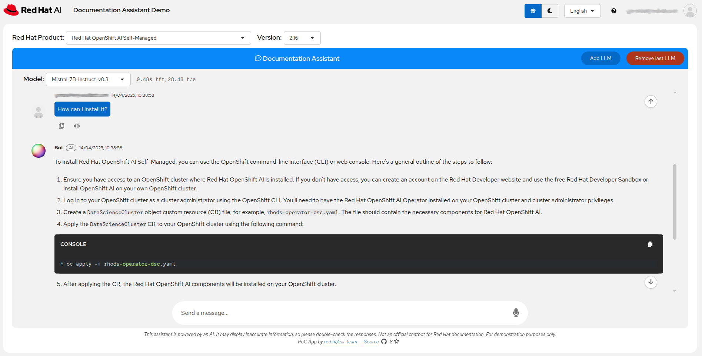

# Red Hat Documentation Chatbot Demo

This demo is a more advanced version of the basic demo that is detailed in this [article](https://ai-on-openshift.io/demos/llm-chat-doc/llm-chat-doc/).



Features:

- Fully automated document ingestion pipeline, with two custom ingestion methods: Red Hat public documentation and generic document using Docling.
- Multiple models support, including running them in parallel to highlight differences in content and speed.
- Multi language support on the UI, the audio, and the generated answers.
- Patternfly 6 based UI, using the Chatbot component.

## Document Ingestion

All the documents are ingested and stored in a Milvus database, using different elements and techniques described below.

### Red Hat documentation

The public Red Hat documentation is ingested using a custom parser and splitter. The goal is to get the most targeted and precise information as possible, removing all unnecessary information that would be extracted with a "non-content-aware process", like tables of contents, disclaimers, references links,... Although sometimes useful or even necessary when accessing or reading the document, they don't bring anything from a context retrieval perspective in a RAG solution.

More details and examples about this document parsing can be found in the [rh-doc-splits-generation](./rh-doc-splits-generation/) folder.

### Generic documentation

Another parser uses [Docling](https://docling-project.github.io/docling/) to extract information from documents accessible through a public URL. They can be web pages, PDFs, etc.

This implementation uses a remote Docling service API, powered by [Docling Serve](https://github.com/docling-project/docling-serve), to perform the extraction.

### Collections

To make it easier to manage the documentation elements that will be ingested, the [collections](./collections/) folder holds their definition. They are simple JSON files indicating for each collection and version the documents sources and the ingestion mechanism to use (Red Hat doc ingester or docling). Documents that are common across different versions of a specific collection can also be added.

### Automation

For each collection and version, a flag indicates whether it should be added, updated, or removed (see more details in the [products-documentation-ingestion](./products-documentation-ingestion/) folder).
Whenever a change is merged into the `main` branch of this folder, a pipeline defined in [tekton](./tekton/) is triggered on the OpenShift cluster where the application is deployed. This pipeline handles creating, updating, or removing collections as needed.

## Application

### Backend

The [app backend](./app/backend/) is a simple FastAPI application that handles all the communications with the models servers, the vector database and the client.

The configuration is set in a single [config.json](./app/backend/config.json.example) file, which makes it easier to be kept in a Secret mounted at runtime for the [deployment](./app/deployment/deployment.yaml) on OpenShift.

### Frontend

This is a [Patternfly 6](https://www.patternfly.org/) application, connected to the backend through  Websocket to receive and display the content streamed by the backend.

### Deployment on OpenShift

- The application container image is available at [https://quay.io/repository/rh-aiservices-bu/rh-kb-chat](https://quay.io/repository/rh-aiservices-bu/rh-kb-chat).
- Deployment files examples are available in the [Deployment](./app/deployment/) folder.
- An example configuration file for accessing the models and vector database is available [here](./app/backend/config.json.example). Once modified with your own values, it must be created as a Secret with:

    ```bash
    oc create secret generic kb-chatbot --from-file=config.json
    ```

- To display the username at the top-right corner of the application and in chat messages, OAuth protection must be enabled via a sidecar container.
